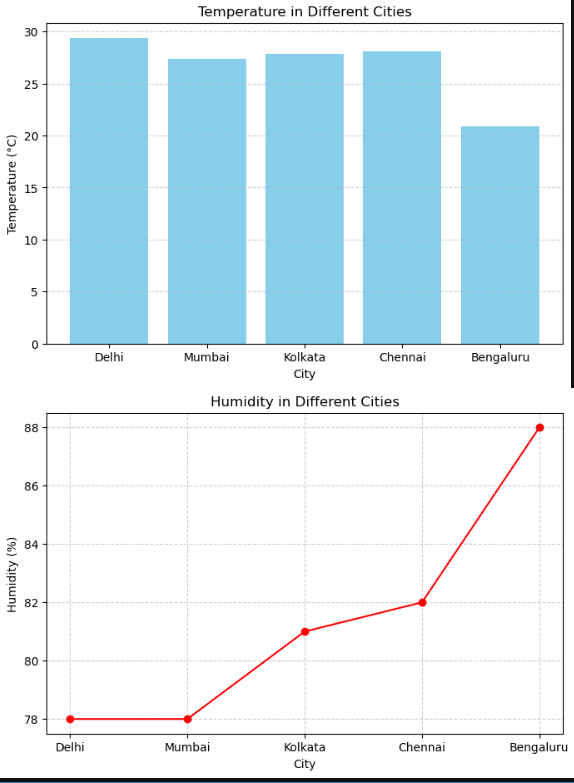

# 🌦️ Task-1: Weather Data Visualization using OpenWeatherMap API

## 👨‍💻 Internship Information
- **Name:** Yashasvi Choudhary
- **Company:** CODTECH IT SOLUTION  
- **Intern ID:** CT04DY141
- **Domain:** Python Programming  
- **Duration:**  July 29th, 2025 to August 29th, 2025.  
- **Mentor:** Neela Santhosh Kumar 

## 📌 Overview
This task fetches **real-time weather data** for multiple Indian cities using the **OpenWeatherMap API** and visualizes it using **Matplotlib**.  
It covers:
- Fetching weather details (Temperature, Humidity, Weather condition)  
- Storing results in a **Pandas DataFrame**  
- Visualizing with **bar charts** and **line plots**

---

## 🛠️ Technologies Used
- **Python 3**
- **Requests** (for API calls)
- **Pandas** (for data handling)
- **Matplotlib** (for visualization)
- **OpenWeatherMap API**

## 📂 Project Structure
Task-1/
│── api_task1.ipynb # Jupyter Notebook containing the code
│── README.md # Documentation (this file)

## 🚀 How to Run
1. Clone the repository:
   ```bash
   git clone https://github.com/Yashasvi-Choudhary/Codtech-Python-Internship.git
   cd Codtech-Python-Internship/Task-1
2.Install required libraries:
pip install requests pandas matplotlib

3. Run the notebook:
Open Jupyter Notebook
Navigate to Task-1/api_task1.ipynb
Run all cells

## 🔑 API Key Setup

This project uses the OpenWeatherMap API.
Replace the placeholder API key in the code:
API_KEY = "your_api_key_here"


##  Data Table

Displays temperature, humidity, and weather description for:

Delhi
Mumbai
Kolkata
Chennai
Bengaluru

## Visualizations

🌡️ Bar Chart → City vs Temperature
💧 Line Chart → City vs Humidity

## 🌦️ Weather Data Visualization

Here is an example chart generated using the Weather API:



