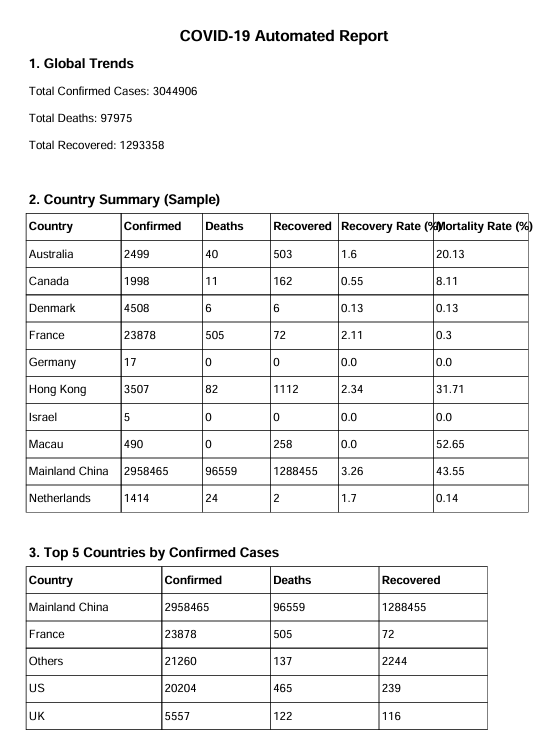

# Task 2: Automated Report Generation

## 👨‍💻 Internship Information

- Name: Yashasvi Choudhary
- Company: CODTECH IT SOLUTION
- Intern ID: CT04DY141
- Domain: Python Programming
- Duration: July 29th, 2025 to August 29th, 2025.
- Mentor: Neela Santhosh Kumar

## 📌 Objective
The aim of this task is to **automate the generation of a PDF report** using Python.  
The program reads structured data, performs analysis, and creates a **formatted report** using libraries like **ReportLab** and **FPDF**.

---

## 📝 Project Description
This project demonstrates how to automatically generate professional reports from raw data.  

- The notebook (`task2_read_file.ipynb`) processes COVID-19 dataset.  
- It calculates key statistics such as:
  - **Total confirmed cases**
  - **Total deaths**
  - **Total recovered**
  - **Recovery and mortality rates by country**  
- A **PDF report (`covid_report.pdf`)** is generated, containing:
  1. Global summary  
  2. Country-level statistics  
  3. Top 5 affected countries  

---

## ⚙️ Requirements
Install the required libraries before running the notebook:

```bash
pip install pandas matplotlib fpdf reportlab
```

## ▶️ How to Run

Clone the repository:
git clone https://github.com/<your-username>/Codtech-Python-Internship.git
cd Codtech-Python-Internship/Task-2

Open and run the notebook:
jupyter notebook task2_read_file.ipynb

After execution, a PDF report will be generated (example: covid_report.pdf).

## 📂 Files in this Task

task2_read_file.ipynb → Jupyter Notebook containing the implementation.
covid_report.pdf → Sample generated PDF report (COVID-19 summary).

## 📊 Sample Report (Extract)
From covid_report.pdf

Global Trends
Total Confirmed Cases: 3,044,906
Total Deaths: 97,975
Total Recovered: 1,293,358

## 🖼️ Report Preview




